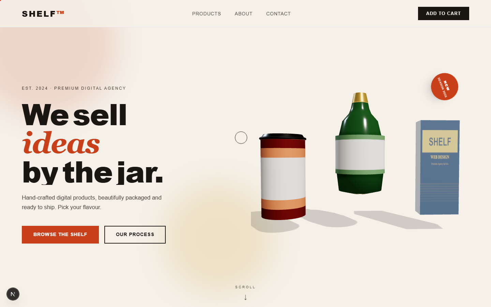

# SHELF™ — Premium Agency



An agency website where services are presented as **supermarket product packaging in 3D**, rendered in real-time with Three.js + WebGL inside a Next.js app.

## Tech Stack

| Tool | Purpose |
|---|---|
| Next.js 15 | App Router, SSR, routing |
| Three.js 0.160 | Real-time WebGL 3D rendering |
| GSAP 3 + ScrollTrigger | Scroll animations, hover interactions |
| Tailwind CSS | Styling with custom design tokens |
| TypeScript | Full type safety |

## Getting Started

```bash
npm install
npm run dev
```

Open [http://localhost:3000](http://localhost:3000).

> **Note:** Run all commands in **Git Bash** (not WSL or PowerShell) to ensure Windows-compatible binaries.

## Project Structure

```
app/
  layout.tsx          # Root layout + metadata
  page.tsx            # Composes all page sections
  globals.css         # Tailwind directives + shared classes

components/
  Navbar.tsx          # Fixed top navigation
  Hero.tsx            # Hero text with GSAP entrance animation
  HeroScene.tsx       # Three.js scene — 3 floating products
  ProductCard.tsx     # Three.js scene per card + hover spin
  ProductsShelf.tsx   # 4-product grid with shelf rail
  About.tsx           # Three.js product cluster + scroll animations
  Process.tsx         # 4-step process grid
  Contact.tsx         # Enquiry form
  Footer.tsx          # Site footer
  CartToast.tsx       # "Added to scope" toast notification

lib/
  products.ts         # ProductConfig type + 4 service definitions
  three-builders.ts   # buildCan / buildBox / buildBottle / buildTube
```

## Products (Packaging Shapes)

| Service | Shape | Colour |
|---|---|---|
| Brand Strategy | Tin Can | Red `#c8401a` |
| Web Design | Cereal Box | Navy `#1c2e4a` |
| 3D Experience | Glass Bottle | Forest Green `#2d5a27` |
| Motion Design | Slim Tube | Purple `#4a2d6e` |

## Using Blender GLTF Models

1. Export your model from Blender as `.glb` into `/public/models/`
2. Add a `gltf` field to the product config in `lib/products.ts`
3. Load it in the component using `GLTFLoader` (already imported in `lib/three-builders.ts`)

## Scripts

```bash
npm run dev      # Start dev server at localhost:3000
npm run build    # Production build
npm run start    # Serve production build
npm run lint     # ESLint
```
